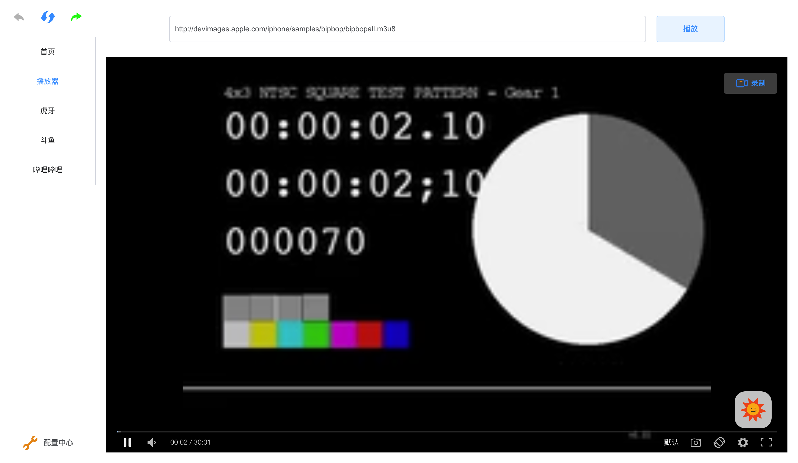
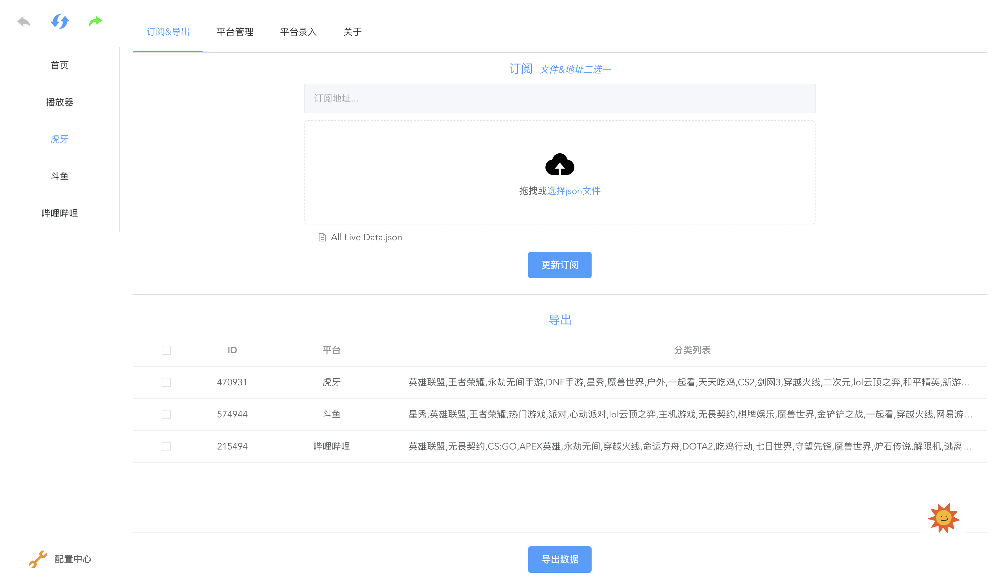

### 关于

* 全新升级的看直播软件。
* 项目地址 [https://github.com/ba0gu0/AllLive](https://github.com/ba0gu0/AllLive)

### 下载地址

* MacOS 64 位 [https://github.com/ba0gu0/AllLive/releases/download/1.1.0/alllive_mac_1.1.0_x64.dmg](https://github.com/ba0gu0/AllLive/releases/download/1.1.0/alllive_mac_1.1.0_x64.dmg)

* MacOS arm64 位 [https://github.com/ba0gu0/AllLive/releases/download/1.1.0/alllive_mac_1.1.0_arm64.dmg](https://github.com/ba0gu0/AllLive/releases/download/1.1.0/alllive_mac_1.1.0_arm64.dmg)

* Windows 64 位安装 [https://github.com/ba0gu0/AllLive/releases/download/1.1.0/alllive_win_1.1.0_x64.exe](https://github.com/ba0gu0/AllLive/releases/download/1.1.0/alllive_win_1.1.0_x64.exe)

* Windows 64 位压缩 [https://github.com/ba0gu0/AllLive/releases/download/1.1.0/alllive_win_1.1.0_x64.zip](https://github.com/ba0gu0/AllLive/releases/download/1.1.0/alllive_win_1.1.0_x64.zip)

* 虎牙、斗鱼、BiliBili 订阅文件 [https://github.com/ba0gu0/AllLive/blob/master/All%20Live%20Data.json](https://github.com/ba0gu0/AllLive/blob/master/All%20Live%20Data.json)

### 功能介绍

> 项目地址: [https://github.com/ba0gu0/AllLive](https://github.com/ba0gu0/AllLive)
* 一个支持全桌面平台、全类型的直播播放器, 可以在Linux(bug有点多，暂不发布此系统)、Windows、macOS系统中使用, 支持RTMP、RTSP、HTTP-FLV、HLS、DASH等直播协议. 
* 支持自定义导入爬取到平台, 通过分析各直播平台的直播协议, 将爬取到的直播信息录入到数据库中, 实现无广告、低内存占用、低CPU占用、多窗口、多直播同时播放.
* 软件提供了录制截图功能, 可以直接在观看直播时进行画面录制, 软件内的画面旋转功能暂时简单可用, 旋转后会造成不能占满屏幕, 后续有空在想办法处理.
* 支持订阅的方式，导入别人爬取的各直播平台的内容。如有想要观看的平台，可以在issue中留下平台相关信息。
* 新平台录入, [docs](./docs)

### 截图

> 首页

>  播放器

> 平台

> 播放页面

> 配置中心

### 免责声明

* 软件遵循MIT协议.
* 本软件为免费软件, 属于业余开发测试工具, 未进行任何盈利行为, 任何基于本软件进行盈利行为都是违法行为, 与作者无关.